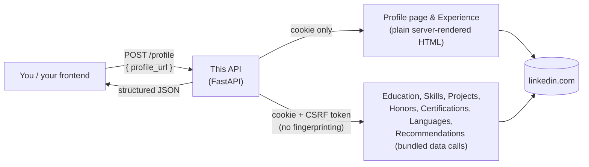
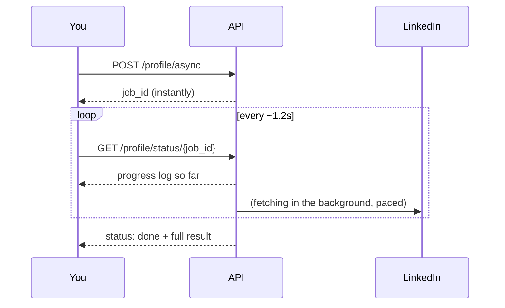

# LinkedIn Profile API

Give it a LinkedIn profile URL, get back clean, structured JSON: name, headline, location,
about, experience, education, skills, certifications, languages, projects, honors & awards,
recommendations, and photos/logos — built for the Tross Careers Team hiring challenge.

The one hard requirement from the challenge was: **no browser automation in the deployed
service** — it has to be a direct HTTP client that talks to LinkedIn the way a real browser
does, not a Chrome instance driven by code. That constraint is what most of this project's
engineering effort went into satisfying.

## How it works, in plain terms

A LinkedIn profile page isn't one request — it's built out of two different kinds of
requests, and we talk to both directly:



- **The main profile page and Experience** are plain, server-rendered HTML — the same page
  you'd see in your browser. A logged-in session cookie is all that's needed.
- **Everything else** (Education, Skills, Projects, Honors & Awards, Certifications,
  Languages, Recommendations) loads through the same background data calls the LinkedIn
  website itself makes after the page loads. We reverse-engineered those calls and replicate
  them with the same login the browser already has — a session cookie plus a CSRF token
  (standard, not a bot-detection bypass) — no fingerprint spoofing, no stealth tricks, no
  headless browser anywhere in the request path.

We also tried the "just drive a real browser" approach first — it's the obvious shortcut,
and several public LinkedIn scrapers do exactly that. We ended up ruling it out (LinkedIn
revokes the session within 1–2 automated page loads, even with a persistent browser profile
and slow, human-like pacing) and instead reverse-engineered the direct requests instead. The
full story, with actual captured requests and every dead end, is in
[`docs/FINDINGS.md`](docs/FINDINGS.md) for anyone who wants the evidence trail.

### Not making you wait on one long request

A cold (uncached) profile fetch makes close enough to a dozen paced requests to LinkedIn
that it can take 20–40 seconds. Rather than holding your connection open that whole time
(and risking a timeout), there's an async job pattern with a live progress log:



The built-in web UI (see below) already uses this and shows the log live, terminal-style. A
plain synchronous `POST /profile` is still available too, for simplicity or for automated
grading that expects one call in, one JSON blob out.

## Quick start

**Option A — Docker (recommended, zero local Python setup):**

```bash
cd direct-api
cp .env.example .env   # then paste your li_at into it (see "Auth" below)
cd ..
docker compose up --build
```

Open **http://localhost:9001/** (also served on `:9002` — same app, two ports).

**Option B — run it directly:**

```bash
cd direct-api
pip install -r requirements.txt
export LI_AT="your_li_at_value_here"      # see "Auth" below
uvicorn api:app --host 0.0.0.0 --port 8000
```

Open **http://localhost:8000/** for the web UI, or call the API directly:

```bash
curl -X POST http://localhost:8000/profile \
  -H "Content-Type: application/json" \
  -d '{"profile_url": "https://www.linkedin.com/in/example/"}'
```

### Auth

The only credential this needs is your own LinkedIn session cookie, `li_at` (DevTools →
Application → Cookies → linkedin.com → `li_at`). It's read from the `LI_AT` environment
variable on the server only — the frontend never asks for it, it's never logged, and it's
never committed (see `.gitignore`).

## API reference

| Endpoint | What it does |
|---|---|
| `POST /profile` | Synchronous — blocks until the profile is fetched, returns the full JSON directly. |
| `POST /profile/async` | Returns a `job_id` immediately; use this if you don't want to hold a request open. |
| `GET /profile/status/{job_id}` | Poll for progress/result — `{"status": "pending" \| "done" \| "error", "log": [...], "result": {...}}`. |
| `GET /health` | Liveness check. |

**Request** (both `/profile` and `/profile/async`):
```json
{ "profile_url": "https://www.linkedin.com/in/example/" }
```

**Result shape:**
```json
{
  "profile": { "name": "...", "headline": "...", "location": "...", "about": "...", "image_url": "..." },
  "experience": [ { "title": "...", "company": "...", "date_range": "...", "logo_url": "..." } ],
  "education": [ { "institution": "...", "degree": "...", "date_range": "...", "logo_url": "..." } ],
  "skills": [ { "name": "...", "details": ["..."] } ],
  "projects": [ { "name": "...", "description": "...", "thumbnail_url": "..." } ],
  "honors_awards": [ { "title": "...", "issuer": "...", "date": "..." } ],
  "certifications": [], "languages": [], "recommendations": [],
  "_meta": { "fetch_status": { "profile": 200, "experience": 200, "...": "..." } }
}
```

`_meta.fetch_status` reports the real HTTP status behind every section, so a caller can tell
"genuinely empty on this profile" apart from "something failed" — nothing is ever silently
faked.

Requests are rate-limited (10/minute/IP by default) and cached in memory per profile URL
(1 hour by default) so re-fetching the same profile is instant.

## What's solid, what to know before relying on it

- **Base profile and Experience** are the most battle-tested — validated against real,
  multi-entry captured data.
- **Education, Skills, Projects, and Honors & Awards** are confirmed working the same
  no-browser way, including real photos/logos where LinkedIn provides them. Which exact
  background data call carries which section is *discovered per profile* rather than
  hardcoded, since it isn't the same for every profile.
- **Certifications, Languages, and Recommendations** use the same mechanism and correctly
  report when a profile genuinely has none — but we haven't yet validated them against a
  profile that actually has populated data in those specific sections, so treat them as
  "should work" rather than "proven" until confirmed against a real example.
- **Posts/recent activity** were investigated and the routes tried didn't resolve
  correctly — not included in the output rather than returning something unreliable.
- **The session cookie can expire or get revoked** by LinkedIn independent of anything
  this service does; the API returns a clear `503` when that happens rather than a
  confusing failure, but recovering it currently needs a human to supply a fresh `li_at`.
- **Caching, rate-limiting, and job tracking are all in-memory**, scoped to a single
  running instance — fine for this deployment, would need a shared store (e.g. Redis) to
  scale across multiple instances.
- Using this against LinkedIn profiles you don't own, at any real scale, runs into
  LinkedIn's own terms of use around automated data collection — this project doesn't
  attempt to address that; it's on whoever operates it to stay within bounds.

Full technical evidence — every request tested, every bug found and fixed, and why the
browser-automation approach was ruled out — lives in [`docs/FINDINGS.md`](docs/FINDINGS.md).
